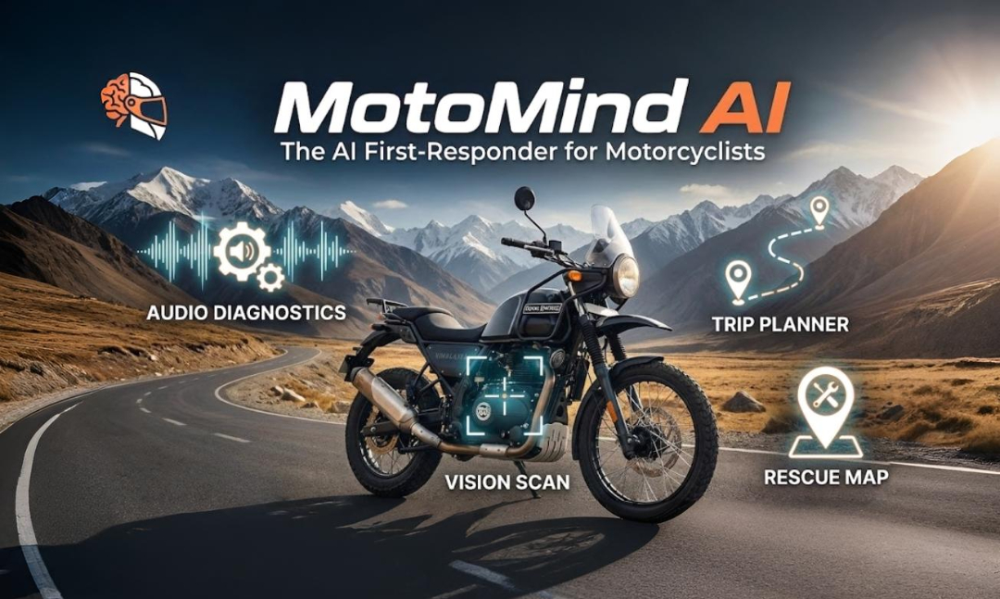
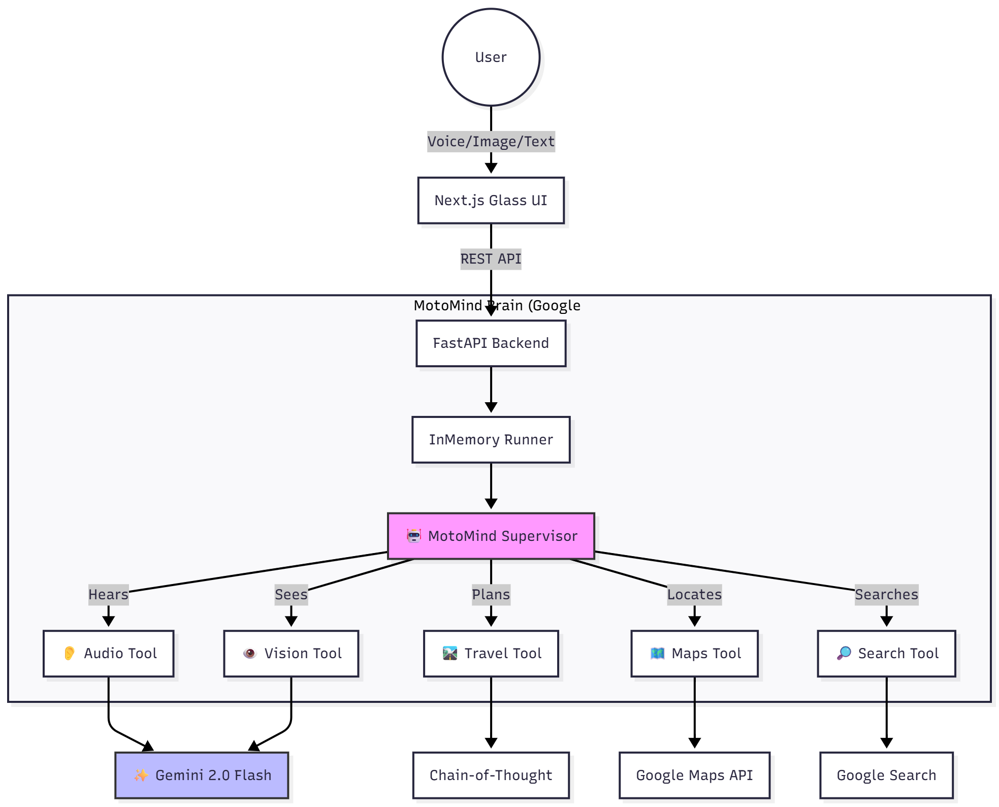

# 🏍️ MotoMind AI  
### The AI First-Responder for Motorcyclists  
**See. Hear. Diagnose. Resolve.**

[](https://deepmind.google/technologies/gemini/)  
[](https://github.com/google/adk)  
[](https://nextjs.org/)  
[](https://fastapi.tiangolo.com/)  
[](https://render.com)

---

<div align="center">
  
### 🎥 [Watch the Demo Video](https://youtu.be/SysBdsB8qjA?si=n7rZo_iJ2xxwQBN6) &nbsp;&nbsp;|&nbsp;&nbsp; 🚀 [Try the Live App](https://moto-mind-capstone.vercel.app)



</div>

---

## 🚨 The Problem: *The Diagnosis Gap*

India has over **200 million motorcycles**, yet riders still face a critical safety challenge during breakdowns.

- Maps only tell you **where**, not **what’s wrong**  
- Generic LLMs hallucinate mechanical advice  
- Riders often make incorrect decisions → damaged engines, expensive repairs, accidents

---

## 💡 The Solution: MotoMind

MotoMind is a **Vertical AI Agent** built as an intelligent first-responder for bikers.  
Powered by **Gemini 2.0 Flash**, it uses multimodal perception to understand your bike like a trained mechanic.

### MotoMind Includes:
- **👀 Vision:** Detects bike model, mods, and visible faults  
- **👂 Audio Hearing:** Identifies knocking, misfires, tappet noise  
- **🧠 Brain:** ADK Supervisor-Agent system for logic & reasoning  
- **🗺️ Maps Intelligence:** Finds real roadside mechanics  
- **🚦 Trip Planning:** Generates Ladakh-ready routes, fuel stops, spare kits  

---

# 🏗️ System Architecture



Tech Stack
   | Layer           | Technology                                       |
| --------------- | ------------------------------------------------ |
| Agent Framework | Google ADK                                       |
| LLM             | Gemini 2.0 Flash                                 |
| Frontend        | Next.js 14, Tailwind CSS, Framer Motion          |
| Backend         | FastAPI, Uvicorn                                 |
| Deployment      | Vercel + Render                                  |
| Tools           | Custom Audio, Vision, Maps, Search, Travel Tools |


The README you pasted looks much better! However, I still see one major error in the architecture diagram block—you are using raw Markdown syntax inside a code block without the proper Mermaid declaration, or sometimes GitHub might struggle if the indentation isn't perfect.

Also, the "Key Capabilities" table at the bottom is a bit broken (the columns are squished together).

Here is the Final Polish for your README.md. I have fixed the Mermaid diagram so it renders perfectly on GitHub, cleaned up the tables, and ensured all image paths are correct.

Copy this entire block and replace your current README.md:

Markdown
<div align="center">

# 🏍️ MotoMind AI
### The AI First-Responder for Motorcyclists
**See. Hear. Diagnose. Resolve.**

[](https://deepmind.google/technologies/gemini/)
[](https://github.com/google/adk)
[](https://nextjs.org/)
[](https://fastapi.tiangolo.com/)
[](https://render.com)

<br/>

### 🎥 [Watch the Demo Video](https://youtu.be/SysBdsB8qjA) &nbsp;&nbsp;|&nbsp;&nbsp; 🚀 [Try the Live App](https://moto-mind-capstone.vercel.app)

<br/>


</div>

---

## 🚨 The Problem: "The Diagnosis Gap"
India has over **200 million motorcycles**. Yet, when a breakdown happens in a remote area like Ladakh, riders face a critical safety gap.
* **Maps aren't enough:** Knowing *where* a mechanic is doesn't help if you don't know *what* is wrong or if the bike is safe to ride.
* **Chatbots fail:** Generic LLMs hallucinate maintenance advice because they lack active perception (sight/sound).

## 💡 The Solution: MotoMind
MotoMind is a **Vertical AI Agent** designed as a mechanical first-responder. It utilizes **Gemini 2.0 Flash** to bridge the gap between digital intelligence and real-world mechanics.

It doesn't just chat. It has:
* **👀 Eyes:** Computer Vision to identify bike models and modifications.
* **👂 Ears:** Acoustic Analysis to detect engine faults (knocking, misfires).
* **🧠 Brain:** Logic to plan logistics and route convoys.

---

## 🏗️ System Architecture

MotoMind uses a **Supervisor-Worker Agent Pattern** wrapped in a production-grade full-stack application.

```mermaid
graph TD
    User((User)) -->|Voice/Image/Text| UI[Next.js Glass UI]
    UI -->|REST API| API[FastAPI Backend]
    
    subgraph "MotoMind Brain (Google ADK)"
        API --> Runner[InMemory Runner]
        Runner --> Agent[🤖 MotoMind Supervisor]
        
        Agent -->|Hears| Tool1[👂 Audio Tool]
        Agent -->|Sees| Tool2[👁️ Vision Tool]
        Agent -->|Plans| Tool3[🛣️ Travel Tool]
        Agent -->|Locates| Tool4[🗺️ Maps Tool]
        Agent -->|Searches| Tool5[🔎 Search Tool]
    end
    
    Tool1 --> Gemini[✨ Gemini 2.0 Flash]
    Tool2 --> Gemini
    Tool3 --> Reasoning[Chain-of-Thought]
    Tool4 --> GMap[Google Maps API]
    Tool5 --> Google[Google Search]
    
    style Agent fill:#f9f,stroke:#333,stroke-width:2px
    style Gemini fill:#bbf,stroke:#333,stroke-width:2px
🔧 Tech Stack
Agent Framework: Google Agent Development Kit (ADK)

LLM: Gemini 2.0 Flash (Multimodal)

Frontend: Next.js 14, Tailwind CSS, Framer Motion

Backend: FastAPI, Uvicorn

Deployment: Render (Dockerized Backend) + Vercel (Frontend)

📸 Capabilities Gallery
<table width="100%"> <tr> <th width="50%">👁️ Visual Diagnostics</th> <th width="50%">👂 Acoustic Analysis</th> </tr> <tr> <td>Identifies bike models, aftermarket mods, and visible damage using Gemini Vision.</td> <td>Analyzes engine waveforms to detect internal faults like <b>Rod Knock</b> or <b>Valve Noise</b>.</td> </tr> <tr> <td></td> <td></td> </tr> </table>

<table width="100%"> <tr> <th width="50%">🛣️ Ladakh Trip Planner</th> <th width="50%">🆘 Rescue Map</th> </tr> <tr> <td>Generates convoy itineraries, fuel stops, and spare parts lists specific to your bike model.</td> <td>Connects to <b>Google Maps API</b> to find hyper-local roadside mechanics (not just showrooms).</td> </tr> <tr> <td></td> <td></td> </tr> </table>


📂 Project Structure
Plaintext

MotoMind-Capstone/
├── agents/                 # Agent definitions and instructions
├── data/                   # Static data (Audio samples for testing)
├── frontend/               # Next.js 14 Application (The Interface)
│   ├── src/app/page.tsx    # Main Dashboard Logic
│   └── ...
├── tools/                  # Custom Toolset
│   ├── audio_tool.py       # Audio Diagnostics
│   ├── vision_tool.py      # Image Analysis
│   ├── maps_tool.py        # Google Places Integration
│   ├── travel_tool.py      # Itinerary Generation Logic
│   └── search_tool.py      # Visual Search Link Generator
├── api.py                  # FastAPI Server (The Brain)
└── agent.py                # Main Agent Configuration

✨ Key CapabilitiesFeatureTech StackReal-World Application👂 Acoustic DiagnosticsGemini 2.0 Flash (Audio)User records engine sound -> AI identifies specific signatures like "Rod Knock", "Tappet Noise", or "Dead Battery Click".👁️ Bike DNA ScannerGemini 2.0 Flash (Vision)User uploads a photo -> AI identifies the Model, Year, and Modifications (e.g., "Royal Enfield Classic 350 with Aftermarket Exhaust").🛣️ Ladakh Trip PlannerReasoning EngineGenerates professional Round-Trip Itineraries with fuel stops, convoy rules for groups, and bike-specific prep advice.📸 Visual SearchGoogle Search ToolsUser asks "Where is the battery?" -> AI fetches direct links to diagrams and photos to guide the user visually.🆘 Rescue MapGoogle Maps APIFinds local roadside mechanics (not just big showrooms) based on precise GPS location.

🚀 Getting Started Locally
Prerequisites
Python 3.10+

Node.js 18+

Google Cloud API Keys

1. Clone the Repo
Bash

git clone [https://github.com/tyagi-anurag/MotoMind-Capstone.git](https://github.com/tyagi-anurag/MotoMind-Capstone.git)
cd MotoMind-Capstone
2. Backend Setup
Bash

# Create virtual environment
python -m venv venv
source venv/bin/activate  # or .\venv\Scripts\activate on Windows

# Install dependencies
pip install -r requirements.txt

# Run Server
uvicorn api:app --reload
3. Frontend Setup
Bash

cd frontend
npm install
npm run dev
Visit http://localhost:3000 to start the engine!

🏆 Hackathon Tracks
Submitting to: Concierge Agents & Freestyle

Built with ❤️ for the Kaggle 5-Day AI Agents Intensive.